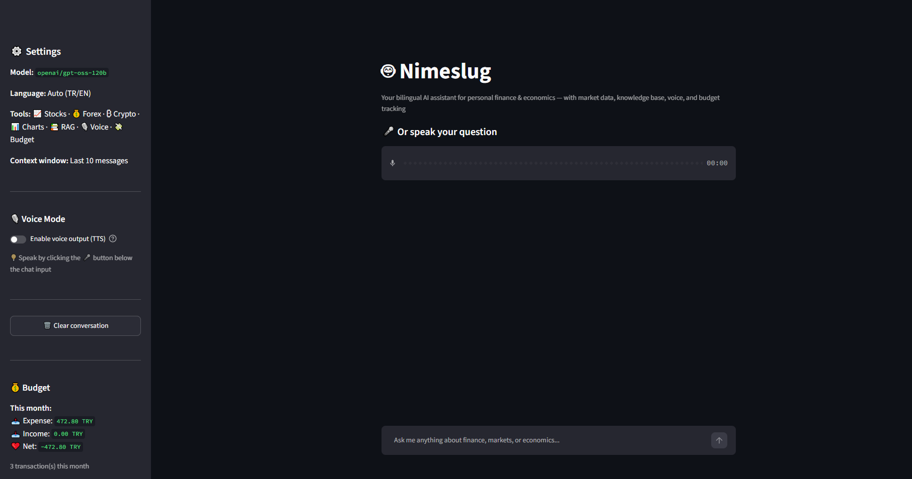
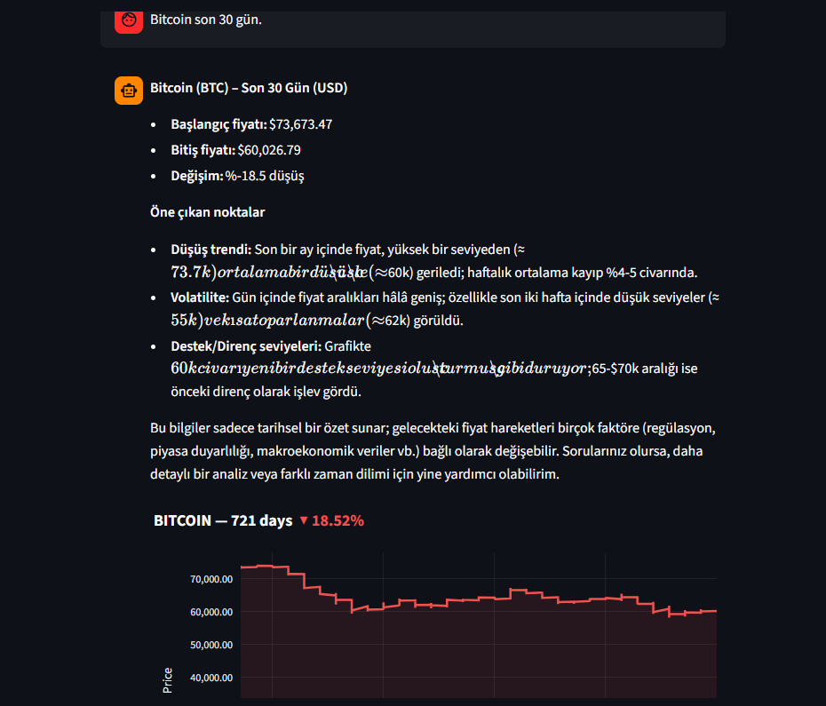
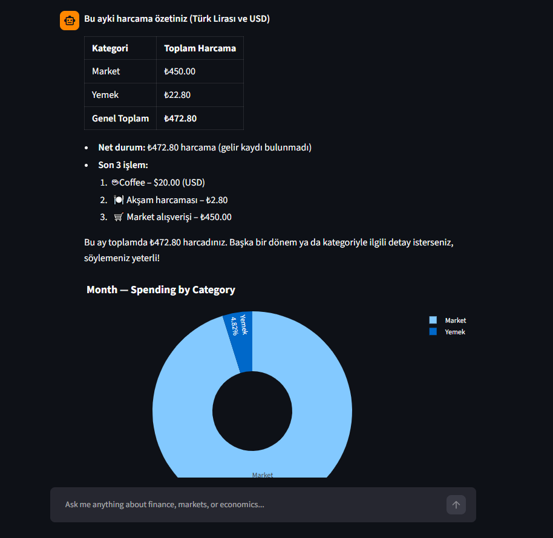
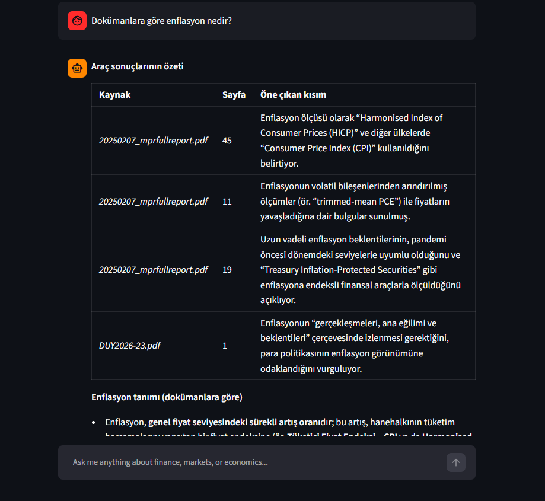

# 🤖 Nimeslug

> Bilingual (TR/EN) personal AI assistant for finance and economics, powered by Llama/GPT-OSS via Groq.

[](https://www.python.org/)
[](https://streamlit.io/)
[](https://groq.com/)
[](LICENSE)
[]()

Nimeslug is a Jarvis-style AI assistant that combines **multi-tool agentic reasoning**, **retrieval-augmented generation (RAG)**, **voice interaction**, and **personal budget tracking** into a single Streamlit app.

---

## ✨ Features

| Feature | Description |
|---------|-------------|
| 🌍 **Bilingual** | Automatically detects and responds in Turkish or English |
| 📈 **Live Market Data** | Real-time stocks (incl. BIST), forex, and cryptocurrency prices |
| 📊 **Interactive Charts** | Historical price visualizations with Plotly |
| 📚 **RAG Knowledge Base** | Upload PDFs, query semantically with multilingual embeddings |
| 🎙️ **Voice Interaction** | Speak to Nimeslug, hear responses (Jarvis mode) |
| 💰 **Budget Tracking** | Natural-language expense tracking with category breakdown |
| 🧠 **Agentic Tool Use** | Multi-step reasoning with automatic tool orchestration |
| 🔐 **Privacy-First** | All data stays local (SQLite + ChromaDB) |

---

## 🎬 Demo

### Main Interface


### Live Market Data with Charts


### Budget Tracking with Visualization


### RAG — Cite-Your-Sources


---

## 🛠️ Tech Stack

- **Language:** Python 3.10+
- **LLM:** GPT-OSS 120B via [Groq](https://groq.com/) (free tier, ~750 tokens/sec)
- **Speech-to-Text:** Whisper Large V3 Turbo (via Groq)
- **Text-to-Speech:** Browser-native `speechSynthesis` API
- **UI:** Streamlit
- **Embeddings:** `paraphrase-multilingual-MiniLM-L12-v2` (multilingual)
- **Vector DB:** ChromaDB (persistent, local)
- **Relational DB:** SQLite via SQLAlchemy
- **Market Data:** yfinance, CoinGecko API
- **Visualization:** Plotly

---

## 🚀 Quick Start

### Prerequisites

- Python 3.10 or higher
- A free [Groq API key](https://console.groq.com)

### Installation

```bash
# 1. Clone the repository
git clone https://github.com/nimeslug/NIMESLUGAI.git
cd NIMESLUGAI

# 2. Create and activate a virtual environment
python -m venv venv

# Windows:
venv\Scripts\activate
# Mac / Linux:
source venv/bin/activate

# 3. Install dependencies
pip install -r requirements.txt

# 4. Configure your API key
# Create a .env file in the project root:
echo GROQ_API_KEY=your_key_here > .env

# 5. Run the app
streamlit run app.py
```

The app opens automatically at `http://localhost:8501`.

---

## 📁 Project Structure
nimeslug/

├── app.py                  # Streamlit UI & main entry point

├── config.py               # Configuration & system prompt

├── requirements.txt

├── .env                    # API keys (not committed)

├── .gitignore

├── README.md

│

├── tools/

│   ├── init.py

│   ├── market_data.py      # yfinance + CoinGecko integration

│   ├── charts.py           # Plotly chart builders

│   ├── rag.py              # ChromaDB + PDF ingestion

│   ├── voice.py            # Whisper STT integration

│   └── budget.py           # SQLite budget tracking

│

├── knowledge_base/         # User PDFs (gitignored)

├── chroma_db/              # Vector embeddings (gitignored)

└── data/

└── budget.db           # SQLite database (gitignored)
---

## 💬 Example Conversations

**Market data:**
> 🧑 "Bitcoin son 30 günü nasıl?"  
> 🤖 _Fetches CoinGecko data, displays interactive chart, summarizes performance._

**Budget tracking:**
> 🧑 "Bugün markete 450 TL harcadım"  
> 🤖 _Records transaction in `Market` category, confirms._
>
> 🧑 "Bu ay ne kadar harcadım?"  
> 🤖 _Returns total + category pie chart._

**RAG (knowledge base):**
> 🧑 "Yüklediğim raporda enflasyon nasıl tanımlanıyor?"  
> 🤖 _Searches embeddings, quotes source PDF with page reference._

**Voice mode:**
> 🎤 _(spoken)_ "Apple hissesi ne durumda?"  
> 🔊 _(spoken response)_ "Apple şu an $234.56'da..."

---

## 🗺️ Roadmap

- [x] Bilingual LLM chat (TR + EN)
- [x] Real-time market data (stocks, forex, crypto)
- [x] Interactive Plotly charts
- [x] Multi-step agentic tool use with iteration loop
- [x] RAG with multilingual embeddings
- [x] Voice interaction (Whisper STT + browser TTS)
- [x] Natural-language budget tracking
- [ ] Multi-agent architecture (LangGraph)
- [ ] Portfolio simulation
- [ ] Automated morning/evening briefings
- [ ] CSV/Excel import for bank statements
- [ ] Goal tracking with progress visualization

---

## ⚙️ Configuration

Available LLM models (edit `config.py`):

```python
LLM_MODEL = "openai/gpt-oss-120b"   # Default — best for tool use
# LLM_MODEL = "openai/gpt-oss-20b"  # Faster, smaller
# LLM_MODEL = "qwen/qwen3-32b"      # Strong multilingual
```

---

## 🔒 Privacy

All personal data stays **local on your machine**:
- Budget transactions → `data/budget.db` (SQLite)
- Document embeddings → `chroma_db/` (ChromaDB)
- Uploaded PDFs → `knowledge_base/`
- API keys → `.env` (gitignored)

Only the LLM prompt (and minimal tool results) are sent to Groq's servers.

---

## ⚠️ Disclaimer

Nimeslug provides **educational information only**. It does **not** offer personalized investment advice. Always consult a licensed financial advisor before making financial decisions.

---

## 📜 License

MIT License — see [LICENSE](LICENSE) for details.

---

## 🙏 Acknowledgments

- [Groq](https://groq.com) for ultra-fast LLM inference
- [Meta](https://ai.meta.com/llama/) & [OpenAI](https://openai.com/) for open-weight models
- [Streamlit](https://streamlit.io) for the rapid UI framework
- [ChromaDB](https://www.trychroma.com/) for the vector database

---

<p align="center">
  Made with ❤️ for learning AI engineering, finance, and economics — all at once.
</p>